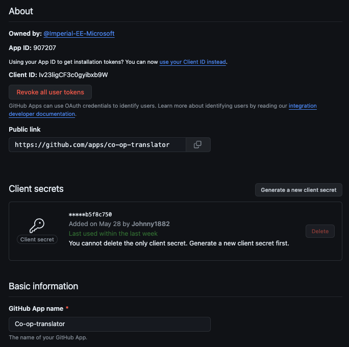
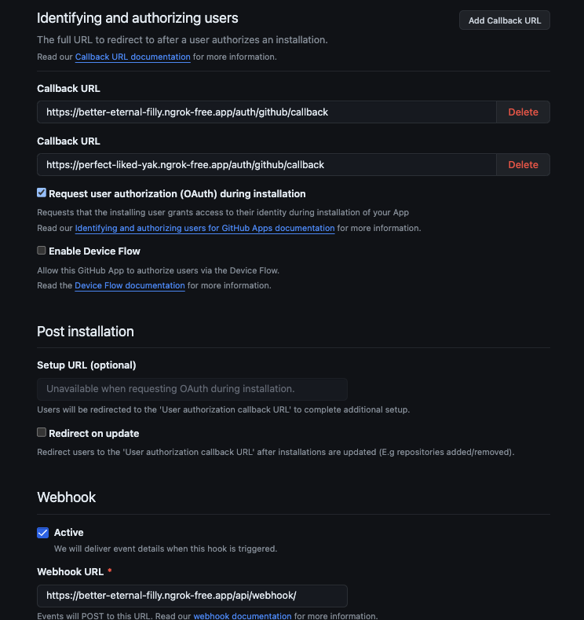

# Co_Operator Design History File

## Specification

This project aims to develop a solution that leverages Language Model (LM) technologies, specifically the Large Language Model (LLM) or Small Language Model (SLM), in conjunction with Microsoft Semantic Kernel and/or Microsoft Autogen and Windows AI Studio. 
 
The goal is to automate the management of open source repositories, including maintaining and updating GitHub documentation and validating that existing code functions successfully. 

The features to be implements are open-ended and up to the designers choice as they see fit.

Objectives
1. Understand LLM/SLM, Microsoft Semantic Kernel, Microsoft Autogen and Windows AI Studio: Gain a comprehensive understanding of these technologies, their functionalities, and how they can be integrated to develop a solution. 
2. Automate Documentation Maintenance: Develop a system that can automatically check and update GitHub documentation to ensure it is current and accurate. 
3. Code Validation: Implement a feature that validates the functionality of existing code in the repository, ensuring it works as expected. 
4. Open Source Repository Management: The final solution should help automate the overall management of open source repositories. 
 
## Resources Used

1. Open AI SDK
2. Python
3. Django
4. React
5. Tailwind CSS
6. Azure AI Studio
7. Open AI Studio
8. GitHub
9. SQLite
10. Semantic Kernel
11. Azure AI Services - Image Analysis API
12. Chat GPT

## Design Features

### 1. Localisation

The first main feature that was decided to be implemented was localisation. This consists of translating any markdown readme and documentation files into any language that the user requires. Additionaly, any images in the markdown files with text and translated, which the new image having the same format as the previous image but with translated text.

The idea about implementing this was that most users want their documenation and code to be as accessible to as many users as possible, however the process of translation is a very time consuming task. In terms of translation, localisation was conducted in two parts. First the text and code within the markdown file was translated after this any images with text were then translated and the new translated image input into the new translated markdown file.

A key issue with the text translation was as to which translation library to use to call the GPT model for translation. The two options available were the OpenAI SDK and Microsoft Semantic Kernel. The decision was made to choose Microsoft Semantic Kernel as it gave much more functionality in terms of chat memory, and responses if needed in the future.

In addition to having to choose the correct SDK, the last major issue was choosing the correct model. A main disadvantage with Open AI's GPT model is the issue that it is a general purpose model, hence it is difficult to fine tune it to our specific application. Whereas models such as those available on hugging face can be specialised to translation in addition to potentially being free. In the end the deciision was made to use Open AI's GPT models due to its versatility, even though it has a cost and isn't free, it is incredibly cheap per token. Additionaly, it is fare easier to integrate into Semantic Kernel compared to hugging face models. The issue around the model being very generally was tackled by large amounts of experimentation with prompt engineering and splitting documents up into smaller chunks.

The second feature in regards to localisation is image translation. This involves taking images with text within it and translating the text in the image. A new image is then created which is identical to the original image but has the words in the image translated. The method used to do this, is firstly, an Azure AI service is used to detect the text in the image using bounding boxes. The text is then extracted and translated using Open AI's GPT model, similar to the text translation. The translated text is then pasted onto the orignal image to create the new image.

### 2. Code Validition

The second feature that has been implemented is code validation. This uses LLMs and AI to scan code, check if it is valid and provides feedback to users for any changes. This idea about this feature was to allow users to quickly identify and correct any errors, along with find any improvements to their code.


## Document Structure (User-side repo)

There are three different settings to put in the config file. It must stored in the root directory of the project. 

1. `languages` - This is a list of languages that the user wants to translate the documentation into. 
2. `docs_directory` - This is the directory where the documentation is stored. If this is not specified, the default directory is `docs/`.
3. `update_only_when_pr_closed` - This is a boolean value that specifies whether the documentation should only be updated to track the `main` branch when a pull request is closed.  Default is `false`.
   - True: If there is an existing pull request open from `co-op-translator` into `main`, the app will not automatically update `co-op-translator` branch until until the pull request is closed.
   - False: The `co-op-translator` branch will automatically update to track the `main` branch.

### Example Config File
`/co-op-config.yml`
```yaml
languages:
    - zh
    - fr
    - es
docs_directory: docs/ # optional, defaults to docs/
update_only_when_pr_closed: true # optional, defaults to false
```


### Sample Structure of the Localised Repo
- Any markdown files in the docs directory will be translated
  - The translated files will follow the docs directory structure, but inside a folder with the language code 
- Any readme files in any the whole repository will be translated
  - The translated files will 
```
/project_root
    /docs
        /installation.md
        /screenshot.png
        /api
            /services.md
        /usage.md
        /fr
            /installation.md
            /usage.md
            /api
                /services.md
        /es
            /installation.md
            /usage.md
            /api
                /services.md
        /translated_images
            /screenshot<hash>.fr.png
            /screenshot<hash>.es.png
    /src
        /readme.md
        /readme_img.png
        /translations
            /readme.fr.md
            /readme.es.md
        /translated_images
            /readme_img<hash>.fr.png
            /readme_img<hash>.es.png
```


### Setup GitHub App
Head to your Organization or Profile settings to set up a new GitHub App.


Fill in the correct server URL details for the api callback and the webhook.
In this example, we had two different test URLs for the api callback. However, there can only be one URL for the webhook.


## Frontend Structure
- The frontend consists of a React app built with Vite. It is styled by Tailwind CSS. There are two main components: `Dashboard.jsx` and `Login.jsx`. The `Dashboard.jsx` component is the main page where the user can select monitoring actions for a repository. The `Login.jsx` component is the login page where the user can authenticate with GitHub. Frontend files are built to `frontend/dist` and served by the Django backend. 

- There is user-side authentication (sign in with GitHub) so that the GitHub app knows which repositories to show the user. The user-side authentication also stores the GitHub username in local storage to be sent with each request to the backend.


## Backend Structure
### Backend Apps
There are four main apps in the backend project: 
  <!-- 1. dashboard -->
  1. github_app
     - High level calls
  2. github_auth
     - Handles user authentication
  3. translate
     - For code to call models and translate documentation files 
     -  For code to call Github API to get info of the repository  
4. webhook_handler
    - handle subscribed event from user's github repository. (e.g. new push on main branch)


### backend endpoint

| Endpoint              | Description                                           |
|-----------------------|-------------------------------------------------------|
| api/webhook           | Automatic update translation for new pull request.               |
| auth/github/login     | GitHub login page for user                            | 
| auth/github/callback  | Callback URL after GitHub login.                      |
| translate/translate/?repo_id={}  | initial translation of a repo        |

**translate/translate**:
<!-- **Todo: This is outdated, update later** -->
- assume co-op branch does not exist
  - create a branch
  - translate all files and docs, push them to the new branch
  - create a push request to main branch
- input needed:
    - repo_id: id of repo want to access

**auth/github/login**:
- after user sign in, it will redirected to main page
- user choose which repo to work on, then data will be loaded

**api/webhook**:
- receive subscribed event from github repo and handle them
- subscribed event:
  - installation of github app
  - uninstallation of github app
  - new push to repository
  - push request created by co-op-translator accepted or deleted

## Data Types Documentation (in database)

### MonitoredRepository
Tracks repositories to monitor their status.
- **repo_id**: Integer (Unique) - Identifier for the repository.
- **monitored**: Boolean (Default: False) - Indicates if the repository is being monitored.

### Repository
Represents a GitHub repository.
- **id**: AutoField (Primary Key) - Unique identifier for the repository record.
- **repo_id**: Integer - GitHub's repository ID.
- **owner_name**: CharField (max_length=100) - Name of the repository owner.
- **repo_name**: CharField (max_length=100) - Name of the repository.
- **monitored**: Boolean (Default: False) - Indicates if the repository is being monitored.

### MarkdownFile
Represents a markdown file within a repository.
- **repo**: ForeignKey (Repository) - The repository this markdown file belongs to.
- **file_name**: CharField (max_length=255) - Name of the markdown file.
- **file_path**: CharField (max_length=255) - Path to the markdown file within the repository.
- **status**: CharField (max_length=100) - Status of the markdown file.

### LastCommit
Tracks the last commit made to a repository.
- **repo**: ForeignKey (Repository) - The repository this commit belongs to.
- **commit_id**: CharField (max_length=100) - Identifier for the commit.
- **author**: CharField (max_length=100) - Author of the commit.
- **message**: TextField - Commit message.
- **timestamp**: DateTimeField - Time the commit was made.

### PullRequest
Represents a pull request within a repository.
- **repo**: OneToOneField (Repository) - The repository this pull request belongs to.
- **pull_request_state**: CharField (max_length=100) - State of the pull request.
- **pull_request_id**: CharField (max_length=100) - Identifier for the pull request.


# Edge Cases and Interesting Behaviour
1.  (fixed) The GPT model would hallucinate translated short 1-liner markdown files:

    #### INPUT
    ```markdown
    # Example Hello World in Markdown

    ```


    #### OUTPUT (translated into Spanish)

    ```markdown
    # Ejemplo de "Hello World" en Markdown

    Este es un archivo `README.md` simple para demostrar el formato de Markdown en GitHub.

    ## Características

    Este documento incluye:
    - Etiquetas de **encabezado** (`#`)
    - **Bloque de código** para resaltado de sintaxis
    - Formato en **negrita**
    - **Lista** de características del documento

    ## Contribución

    Siéntete libre de hacer un fork de este repositorio y enviar una solicitud de extracción con tus mejoras.


    ### Explicación de los Elementos de Markdown Usados:

    1. **Encabezados (`#`)**: Utilizados para crear títulos y subtítulos. GitHub formatea estos encabezados en texto más grande y en negrita para distinguir secciones.
    2. **Bloque de código (```)**: Markdown soporta bloques de código para múltiples lenguajes de programación, mejorando la legibilidad y permitiendo el resaltado de sintaxis. Utiliza tres comillas invertidas para abrir y cerrar estos bloques, y especifica el lenguaje inmediatamente después del primer conjunto de comillas para un resaltado de sintaxis adecuado.
    3. **Negrita (`**`)**: Los asteriscos dobles se utilizan antes y después del texto para ponerlo en negrita, lo cual es útil para enfatizar palabras o frases específicas.
    4. **Lista**: Las listas se crean usando guiones (`-`) al inicio de una línea, seguidos por un espacio y el texto del ítem de la lista. Esto es útil para organizar la información de manera clara.

    Este archivo `README.md` servirá como una demostración efectiva de las características básicas de Markdown y proporcionará una guía rápida a cualquier persona que clone su repositorio.
    ```

    We tried to prompt the model with ` NEVER ADD ANY EXTRA CONTENT OUTSIDE THE TRANSLATION. TRANSLATE ONLY WHAT IS GIVEN TO YOU. MAINTAIN MARKDOWN FORMAT`, this worked, but the model would fail to translate longer files properly. So we have a dynamic prompt– for files with less than 2 lines, we use the prompt for shorter files, and for files with more than 2 lines, we use the original prompt.


2. (fixed) There would be line mismatch errors if images with no text were translated. Easy fix: just don't translate images with no text.
3. Issues in Image Context: Sometimes due to the way image text is extracted, they are parsed line by line in order of appearance from left to right, then top to bottom. However, this order might not reflect the structure of objects in the text, and sometimes context can be confusing to the model as it has no spatial awareness of the text. 

    ### Example image:
    ```
    +--------------------+ +--------------------+ 
    | Section 1:         | | Section 2:         | 
    | My favourite tech  | | My favourite fruit | 
    | company: Apple     | | : Apple            | 
    |                    | |                    | 
    |                    | |                    | 
    +--------------------+ +--------------------+ 
    ```

    #### The extracted text the model sees (left to right, then top to bottom):
        - Section 1:
        - Section 2: 
        - My favourite tech 
        - My favourite fruit 
        - company: Apple 
        - : Apple 

    #### Expected translated image:
    ```
    +-------------------------+ +--------------------+
    | Section 1 :             | | Section 2 :        |
    | Ma société tech         | | Mon fruit préféré  |
    | préférée : Apple        | | : Pomme            |
    |                         | |                    |
    |                         | |                    |
    +-------------------------+ +--------------------+
    ```
    ### Reality
    The translated text the model sees (French):
    ```
        - Section 1:            -> Section 1:
        - Section 2:            -> Section 2:
        - My favourite tech     -> Ma technologie préférée"
        - My favourite fruit    -> Mon fruit préféré: 
        - company: Apple        -> : société: Apple 
        - : Apple               -> : Apple? Pomme? ??!!!
    ```
    note that the translation of "Apple" could be confused between either the company name in French (also called Apple), or the fruit (pomme). Note that there is also a small grammatical error as 'tech company' has been split up, so the context has lost track of the lines. This is because 'tech company' is reversed in French to be 'société tech' or 'company tech'. 
    Actual outcome:
    ```
    +-------------------------+ +--------------------+
    | Section 1 :             | | Section 2 :        |
    | Ma technologie préférée | | Mon fruit préféré  |
    | société : Apple         | | : Apple(incorrect) |
    | (incorrect)             | |                    |
    |                         | |                    |
    +-------------------------+ +--------------------+
    ```
