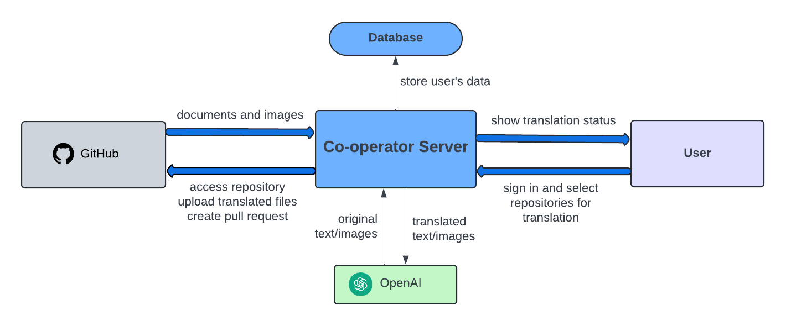

# Co-op-translator
Co-Operator is designed to automate the tedious and time-consuming task of localization in large repositories. This involves translating all images, documents, and code examples to make them accessible to developers worldwide. By automating these processes, we aim to streamline repository management and enhance productivity.

> [!WARNING]
> This GitHub repository is only a public mirror of a private repository used for a proof-of-concept demo. Please do not install any links or apps as this repository is not actively being maintained.

## User-Side Setup
1. access co-op-translator [here](https://github.com/apps/co-op-translator)
2. click install
3. choose the account/organization and repositories you want to install co-op-translator on
4. you will be redirected to app homepage, click invite robot to invite robot account to the repo as cooperator
5. active the repo, and co-op-translator is working!

## Developer Setup

1. **Create and Enter Your Own Virtual Environment**  
   ```bash
   python -m venv venv
   # Windows
   .\venv\Scripts\activate
   # Mac
   source venv/bin/activate
   # To leave the virtual environment
   deactivate
   ```
2. **install dependencies**
    ```bash
    pip install -r requirements.txt
    cd frontend && npm install
    ```

3. **build frontend in `\frontend`**
    ```bash
    npm run build
    ```

4. **start backend server**
    ```bash
    # . Make sure you are in the root directory of the project.
    `cd backend`
    `python manage.py runserver 8080`
    ```
5. **api keys**
   Create a `.env` file following the `.env.template` file, filling in API keys and endpoints and the information of the GitHub app.


7. **deploy & debug**\
   use ngrok for debugging, by exposing the server to the internet.. Currently to use ngrok, you need to create a personal account and reserve a free url to test OAuth. Run a command similar to the below, but use your domain name.\
   \
    **Note**: In the `.env` file, update SERVER_URL to the ngrok url.

    ```bash
    # replace domain=... with your own domain
    ngrok http --domain=perfect-liked-yak.ngrok-free.app 8080
    ngrok http --domain=better-eternal-filly.ngrok-free.app 8080
    ```

    You can also run `ngrok.sh` to automatically start the ngrok tunnel. The script fetches the `SERVER_URL` automatically from the `.env` file, so make sure you have it listed there.


To set up ngrok, follow steps 1-2 [here](https://ngrok.com/docs/getting-started/) but set up a reserved url on the website portal instead of a random one.

<!-- ## Shortcut Run
- After installing all dependencies, just call `run.sh` from the root directory to set everything up automatically -->

## Project Structure


## Backend Structure
### Backend Apps
There are four main apps in the backend project: 
  <!-- 1. dashboard -->
  1. github_app
     - High level calls
  2. github_auth
     - Handles user authentication
  3. translate
     - For code to call models and translate documentation files 
     -  For code to call Github API to get info of the repository  
4. webhook_handler
    - handle subscribed event from user's github repository. (e.g. new push on main branch)


### backend endpoint

| Endpoint              | Description                                           |
|-----------------------|-------------------------------------------------------|
| api/webhook           | Automatic update translation for new pull request.               |
| auth/github/login     | GitHub login page for user                            | 
| auth/github/callback  | Callback URL after GitHub login.                      |
| translate/translate/?repo_id={}  | initial translation of a repo        |

**translate/translate**:
<!-- **Todo: This is outdated, update later** -->
- assume co-op branch does not exist
  - create a branch
  - translate all files and docs, push them to the new branch
  - create a push request to main branch
- input needed:
    - repo_id: id of repo want to access

**auth/github/login**:
- after user sign in, it will redirected to main page
- user choose which repo to work on, then data will be loaded

**api/webhook**:
- receive subscribed event from github repo and handle them
- subscribed event:
  - installation of github app
  - uninstallation of github app
  - new push to repository
  - push request created by co-op-translator accepted or deleted

## State
- [ ] To do: Come up with a state diagram

## Translation Structure

### Markdown File locations

- **README.md Translation**: 
  - A `translation` folder will be created at the same directory level as `README.md`.
  - The translated file will be named `README.lg.md`, where `lg` is the language code.

- **Other .md Files Translation**: 
  - All documents to be translated are assumed located in `/project_root/docs`.
  - For each language, a separate folder will be created within `docs`, maintaining the same structure as the original.
  - For example, the translated version of `/project_root/docs/file_path` will be located at `/project_root/docs/language/file_path`.

- **Sample Structure**: 
```
/project_root
    /docs
        /installation.md
        /screenshot.png
        /api
            /services.md
        /usage.md
        /fr
            /installation.md
            /usage.md
            /api
                /services.md
        /es
            /installation.md
            /usage.md
            /api
                /services.md
        /translated_images
            /screenshot<hash>.fr.png
            /screenshot<hash>.es.png
    /src
        /readme.md
        /readme_img.png
        /translations
            /readme.fr.md
            /readme.es.md
        /translated_images
            /readme_img<hash>.fr.png
            /readme_img<hash>.es.png
```
### Info:
- All markdown files are translated from the primary language (English in this case) to other languages (French, Spanish, etc.)
- Any changes to the translated markdown files are left ignored, they are the translator's edits
  - All images used by the markdown file are 'translated' and stored in a separate folder near to the translated markdown files
  - The translated images are stored in a separate folder, and the image filename has a hash taken from the image path in order to prevent file naming conflicts
  - This is because a md file could reference an image from two different directories, but they have the same name. However, they are all stored together for their translated versions
  - This also prevents us from having to use a database to keep track of images
  - When an image is updated in the primary language:
    - Generate the hash from the image path and append it to the image filename to get the translated image filename 
    - [Search the github repo](https://stackoverflow.com/questions/25022016/get-all-file-names-from-a-github-repo-through-the-github-api) for all instances of &lt;img_filename&gt;&lt;hash&gt;.xx.y
      - xx is the country code which are any two alphabets
      - y is the file extension which can be any image used in markdown files
      - The github api will return their filepaths
    - Generate all new translated images.
    - Using the filepaths from the api, replace the old translated images with the new images
- Only a change in the primary language markdown file will trigger a re-translation of the other languages
- This may use a lot of tokens, however, in major open source projects, commits to main are not very frequent, so this should not be a problem

# API

### GitHub Authentication (`github_auth`)

- **Login with GitHub**: `/auth/github/login/`  
  Initiates the login process with GitHub.

- **GitHub OAuth Callback**: `/auth/github/callback/`  
  Handles the callback from GitHub after the OAuth flow, completing the authentication process.

- **Check GitHub Login Status**: `/auth/github/status/`  
  Checks and returns the current GitHub login status of the user.

### Translation (`translate`)

- **Initialize Translation**: `/translate/init/`  
  Send an invite for the robot to join the GitHub repo. This is automatically called during `translate/translate/`.

- **Get Repositories**: `/translate/repos/`  
  Get a list of all repositories for the current login user from the Django database, including their monitored status. For the frontend

- **Enable Monitoring**: `/translate/repos/monitor/<int:repo_id>/true/`  
  Enables monitoring for changes in the specified repository. A monitored repository gains a new `co-op-translator` branch and the translations are updated to follow the main branch.

- **Disable Monitoring**: `/translate/repos/monitor/<int:repo_id>/false/`  
  Disables monitoring for the specified repository. The `co-op-translator` branch is deleted.

- **Translate Markdown**: `/translate/translate/`  
  Endpoint to translate markdown files in a repository, and create a pull request with the changes.

### Webhook Handler (`webhook_handler`)

- **Webhook Endpoint**: `/api/webhook/`  
  Handles webhook events from GitHub.

- **Refresh Installed Repositories**: `/api/refresh/`  
  Triggers a refresh of the installed repositories on the app's db with newly fetched repos that the github bot can access


# Bugs
## Image Duplication Issue
  - There are two separate areas for translation; either markdown files inside the docs directory or the README files that can be placed anywhere in the repository
  - Translated images that are in the docs directory cannot be accessed by translated README files, and translated images for README files cannot be accessed by translated markdown files in the docs directory.
  - So if an image is used in both a README file and a markdown file, it will need to have two copies, one in the docs directory and one in the root directory. 
## Image Translations
  - There is an issue where all images in the repository will be translated regardless of whether they are used in the markdown files or not. This is because the image translation is done separately from the markdown translation on a detect-all basis.
  - To fix this requires the whole app to be changed so that it only translate images that are detected during the markdown translation process. This will require a major overhaul of the translation process and the way images are stored and accessed.
